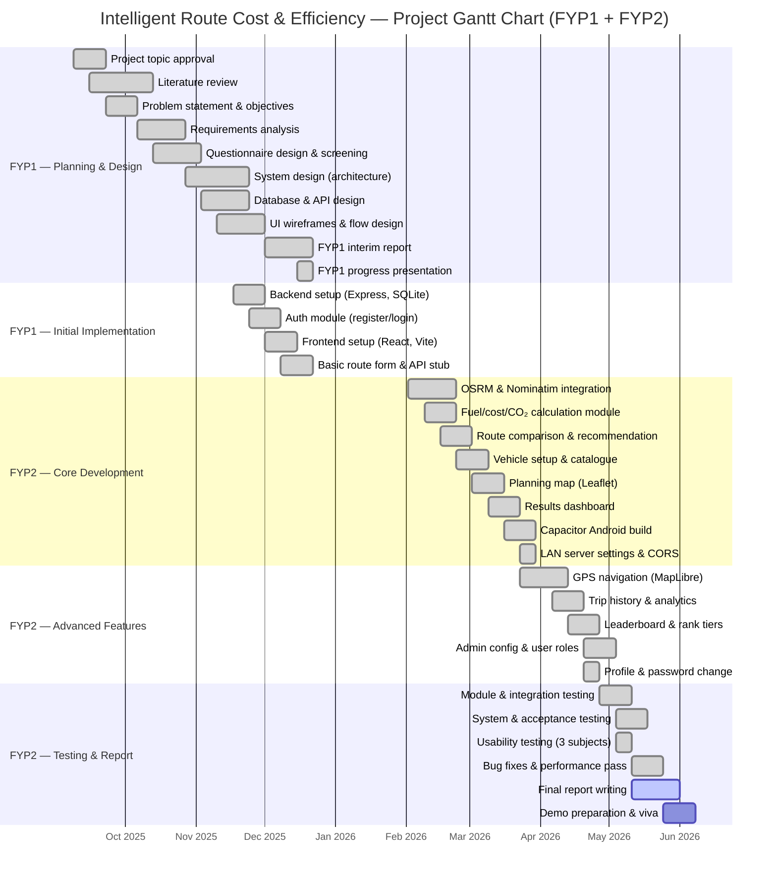

# CHAPTER 9: APPENDICES

This chapter provides supplementary material referenced in the main report. **Appendix A** presents the updated project Gantt chart covering **FYP1 and FYP2**. Additional appendices list supporting documents that may be attached in full in the submitted report binder or digital appendix folder.

---

## List of Appendices

| Appendix | Title | Referenced in |
|----------|-------|---------------|
| **A** | Project Gantt Chart (updated from FYP1) | Chapters 1, 4, 5 |
| **B** | Requirements questionnaire and screening questions | Chapter 3 |
| **C** | Full test case tables (unit, integration, system) | Chapter 6 |
| **D** | Usability test session records | Chapter 6 |
| **E** | API endpoint summary | Chapters 4, 5 |
| **F** | Database schema (SQL) | Chapters 4, 5 |
| **G** | Calculation formulas and worked example | Chapters 2, 5 |
| **H** | Installation and deployment guide | Chapter 5 |
| **I** | User manual (step-by-step flows) | Chapter 5 |
| **J** | UI screenshots | Chapters 4, 5, 6 |
| **K** | Vehicle catalogue (Malaysian models) | Chapters 3, 5 |
| **L** | Source code listings (selected modules) | Chapter 5 |

*Appendices B–L may be included as separate files or printed excerpts. The project source code and `docs/` folder serve as the primary evidence for implementation appendices.*

---

## Appendix A: Project Gantt Chart (Updated from FYP1)

### A.1 Purpose

The Gantt chart shows the **planned and actual schedule** for Intelligent Route Cost & Efficiency across **Final Year Project 1 (FYP1)** and **Final Year Project 2 (FYP2)**. It was first prepared during FYP1 for the interim proposal and progress report, and **updated in FYP2** to reflect completed work, revised timelines, and additional tasks (GPS navigation, trip history, leaderboard, admin module, and testing).

The schedule follows the **iterative and incremental** methodology described in Chapter 1.6.

### A.2 Assumed academic timeline

**Table A.1** Project phases and academic periods

| Phase | Period | Academic stage |
|-------|--------|----------------|
| FYP1 | September 2025 – January 2026 | Semester 1 — proposal, design, initial implementation |
| FYP2 | February 2026 – May 2026 | Semester 2 — completion, testing, final report |

*Replace dates in Table A.1 and Figure A.1 with your faculty’s official FYP1/FYP2 calendar if different.*

### A.3 Gantt chart (FYP1 + FYP2)

**Figure A.1** Project Gantt chart — Intelligent Route Cost & Efficiency

*Export Figure A.1 as an image for your Word/PDF report (Mermaid Live Editor, draw.io, or Microsoft Project). Mark tasks `done` / `active` to match your actual progress at submission.*

### A.4 Task summary table

**Table A.2** Major project tasks by FYP phase

| Task ID | Task | FYP phase | Planned duration | Status |
|---------|------|-----------|------------------|--------|
| T01 | Topic approval and project charter | FYP1 | 2 weeks | Completed |
| T02 | Literature review | FYP1 | 4 weeks | Completed |
| T03 | Requirements analysis and questionnaire | FYP1 | 3 weeks | Completed |
| T04 | System design (use cases, architecture, ERD) | FYP1 | 4 weeks | Completed |
| T05 | Backend foundation (Express, SQLite, auth) | FYP1 | 4 weeks | Completed |
| T06 | Frontend foundation (React, login, layout) | FYP1 | 3 weeks | Completed |
| T07 | FYP1 interim report and presentation | FYP1 | 3 weeks | Completed |
| T08 | OSRM/Nominatim routing integration | FYP2 | 3 weeks | Completed |
| T09 | Fuel, cost, and CO₂ calculation | FYP2 | 2 weeks | Completed |
| T10 | Vehicle setup and results dashboard | FYP2 | 3 weeks | Completed |
| T11 | Planning map and Android (Capacitor) | FYP2 | 3 weeks | Completed |
| T12 | GPS navigation (MapLibre) | FYP2 | 3 weeks | Completed |
| T13 | Trip history, analytics, leaderboard | FYP2 | 3 weeks | Completed |
| T14 | Admin module and user roles | FYP2 | 2 weeks | Completed |
| T15 | Testing and evaluation | FYP2 | 3 weeks | Completed |
| T16 | Refinement and documentation | FYP2 | 2 weeks | Completed |
| T17 | Final report and viva preparation | FYP2 | 3 weeks | In progress |

### A.5 Changes from the FYP1 Gantt chart

**Table A.3** Updates made to the original FYP1 schedule in FYP2

| Change | FYP1 plan | FYP2 update | Reason |
|--------|-----------|-------------|--------|
| Navigation module | Planned as basic map display only | Full turn-by-turn GPS with MapLibre | User requirement for in-app guidance (FR-05) |
| Trip persistence | Planned for “future phase” | Implemented with SQLite trips table | Core engagement feature for registered users |
| Leaderboard | Optional / stretch goal | Implemented with seven rank tiers | Usability feedback and gamification objective |
| Admin module | Not in FYP1 chart | Added config and role management | Demonstration and evaluation requirement |
| Mobile LAN setup | Not detailed in FYP1 | Added Server Settings and CORS tasks | Android cannot use localhost; discovered during integration |
| Testing | Single “testing” block at end | Split into module, integration, system, usability, acceptance | Matches Chapter 6 structure |
| Performance pass | Not listed | Added after navigation bug fixes | Stability for demo and viva |

### A.6 Milestones

**Table A.4** Project milestones

| Milestone | Target date | Deliverable | Status |
|-----------|-------------|-------------|--------|
| M1 — FYP1 proposal approved | Sep 2025 | Signed project form | Completed |
| M2 — Requirements & design complete | Nov 2025 | Use case diagram, ERD, architecture | Completed |
| M3 — FYP1 interim submission | Dec 2025 | Interim report + basic prototype | Completed |
| M4 — Core routing working | Feb 2026 | 3 routes + cost/CO₂ comparison | Completed |
| M5 — Android APK on device | Mar 2026 | Capacitor build on LAN | Completed |
| M6 — Navigation feature complete | Apr 2026 | GPS turn-by-turn on recommended route | Completed |
| M7 — All modules integrated | Apr 2026 | Auth, trips, leaderboard, admin | Completed |
| M8 — Testing complete | May 2026 | Chapter 6 test evidence | Completed |
| M9 — Final report submission | May 2026 | Full FYP2 report | In progress |
| M10 — Project viva / demo | May–Jun 2026 | Live demonstration | Planned |

---

## Appendix B: Requirements Questionnaire (Summary)

The full questionnaire includes **eight screening questions (S1–S8)** and main sections on route planning, fuel cost awareness, CO₂ interest, navigation preferences, and leaderboard motivation. See Chapter 3, Tables 3.1–3.2 and Section 3.2.2 for the complete instrument.

*[Attach full questionnaire document here in your final submission.]*

---

## Appendix C: Full Test Case Tables

Chapter 6 summarises testing results. The complete **42 unit tests**, **7 integration tests**, system test matrix, and acceptance test forms should be attached here as extended tables.

*[Copy Tables 6.2–6.5 from Chapter 6 or export from your test log spreadsheet.]*

---

## Appendix D: Usability Test Records

Session logs for three usability subjects (Tasks T1–T9), including date, duration, observations, and Pass/Fail. See Chapter 6, Section 6.4.

*[Insert completed dates and participant codes where Chapter 6 marks [Insert].]*

---

## Appendix E: API Endpoint Summary

| Method | Endpoint | Auth | Description |
|--------|----------|------|-------------|
| GET | `/api/health` | No | Server health check |
| POST | `/api/auth/register` | No | Register new user |
| POST | `/api/auth/login` | No | Login |
| POST | `/api/auth/change-password` | Yes | Change password |
| POST | `/api/route` | No | Calculate routes and estimates |
| GET | `/api/trips` | Yes | List user trips |
| GET | `/api/trips/analytics` | Yes | Trip analytics dashboard |
| POST | `/api/trips` | Yes | Record completed trip |
| GET | `/api/leaderboard` | No | Leaderboard rankings |
| GET | `/api/leaderboard/ranks` | No | Rank tier definitions |
| GET | `/api/admin/config` | Admin | Get calculation settings |
| PUT | `/api/admin/config` | Admin | Update fuel price / emission factor |
| GET | `/api/admin/users` | Admin | List users |
| PATCH | `/api/admin/users/:id/role` | Admin | Change user role |

*Authentication uses the `X-User-Id` header after login (see Chapter 5).*

---

## Appendix F: Database Schema

Core tables: `users`, `trips`, `leaderboard_entries`. Full `CREATE TABLE` statements are in `backend/src/services/database.js` (`initSchema` function).

---

## Appendix G: Calculation Formulas

**Fuel (L)** = distance (km) ÷ efficiency (km/L)

**Cost (RM)** = fuel (L) × price per litre (RM/L)

**CO₂ (kg)** = fuel (L) × emission factor (kg CO₂/L)

**Savings** = difference between recommended route and comparison route (money, fuel, CO₂).

Default values: 14 km/L, RM 2.50/L, 2.31 kg CO₂/L (`backend/src/config/defaults.js`).

---

## Appendix H: Installation Guide (Brief)

1. **Backend:** `cd backend` → `npm install` → `npm run dev` (port 4000).
2. **Frontend:** `cd frontend` → `npm install` → `npm run dev` (port 5173).
3. **Android:** `npm run cap:sync` → `npm run cap:open` → Run in Android Studio.
4. **Mobile testing:** Set Server Settings to `http://<PC_LAN_IP>:4000`; enable `CORS_ALLOW_LAN=1` on backend.

See `docs/PROJECT_DETAILED.md` for full deployment steps.

---

## Appendix I: User Manual (Outline)

1. Open app → Login, Register, or Continue as Guest.
2. Choose vehicle (or Skip for 14 km/L default).
3. Enter origin and destination → Calculate route.
4. Review results → Start navigation (optional).
5. Complete trip → View savings (registered users).
6. Access Trip History, Leaderboard, Profile from menu.
7. Admin: configure fuel price and user roles at `/admin`.

---

## Appendix J: UI Screenshots

| Figure | Screen | Phase |
|--------|--------|-------|
| J.1 | Login / register modal | Auth |
| J.2 | Vehicle selection | Car setup |
| J.3 | Route search form | Search |
| J.4 | Results dashboard + map | Results |
| J.5 | GPS navigation | Navigate |
| J.6 | Trip history & analytics | Profile |
| J.7 | Leaderboard | Leaderboard |
| J.8 | Admin configuration | Admin |
| J.9 | Server settings (mobile) | Settings |

*[Capture screenshots from web and Android for final submission.]*

---

## Appendix K: Vehicle Catalogue

Malaysian market models in `frontend/src/data/vehicles.js`: **Toyota**, **Honda**, **Proton**, **Perodua** with petrol km/L values for mixed driving.

---

## Appendix L: Selected Source Code Listings

Suggested excerpts for the report binder:

| Listing | File | Purpose |
|---------|------|---------|
| L.1 | `backend/src/utils/calc.js` | Fuel, cost, CO₂ calculation |
| L.2 | `backend/src/services/maps.js` | OSRM and Nominatim integration |
| L.3 | `backend/src/services/auth.js` | Password hashing and login |
| L.4 | `frontend/src/components/NavigationMapView.jsx` | Navigation map rendering |
| L.5 | `frontend/src/App.jsx` | Application phase flow |

---

*End of Chapter 9*
