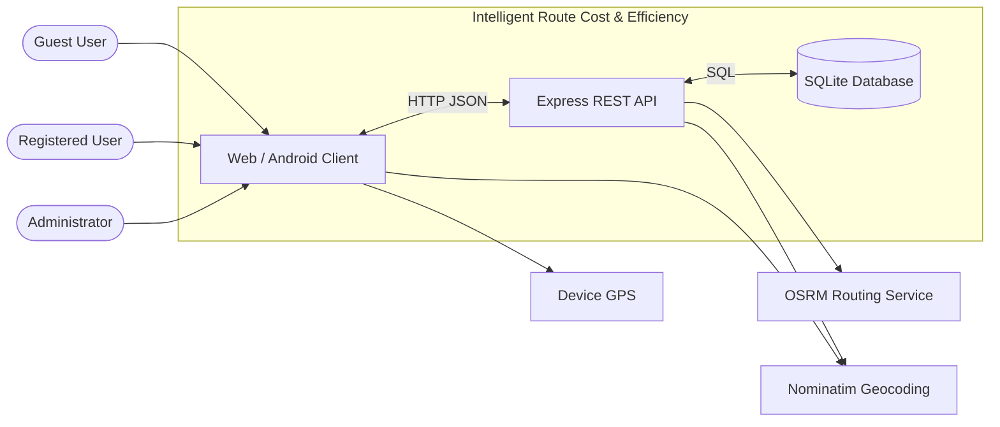
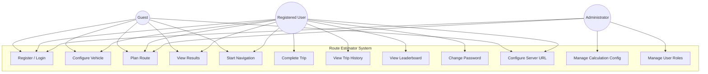
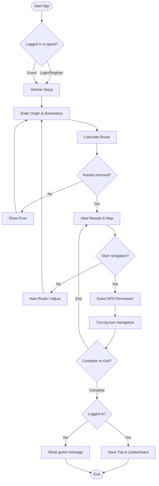
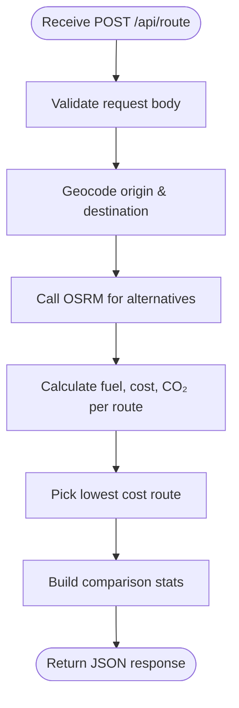
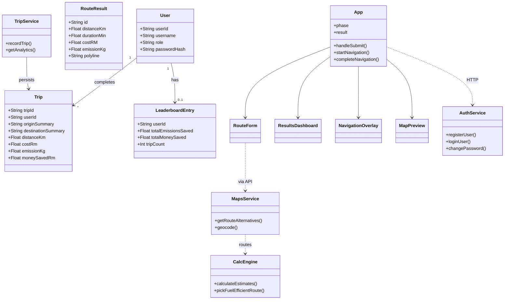
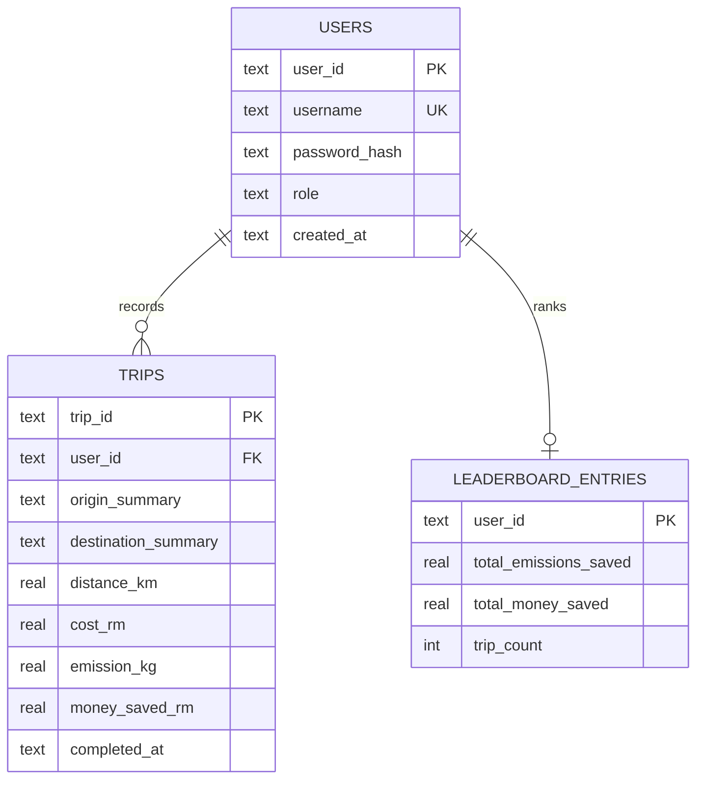
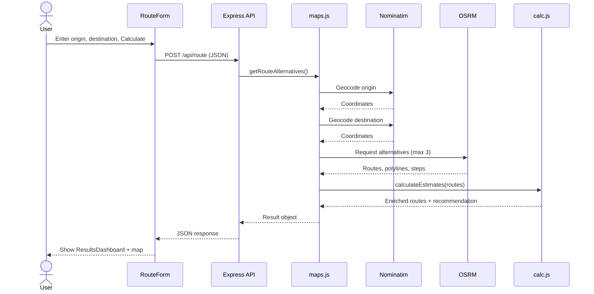
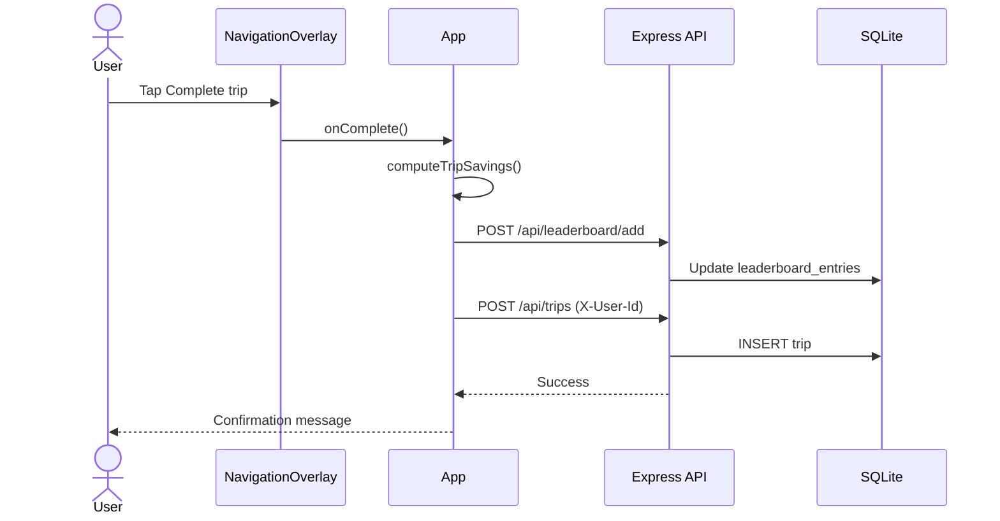
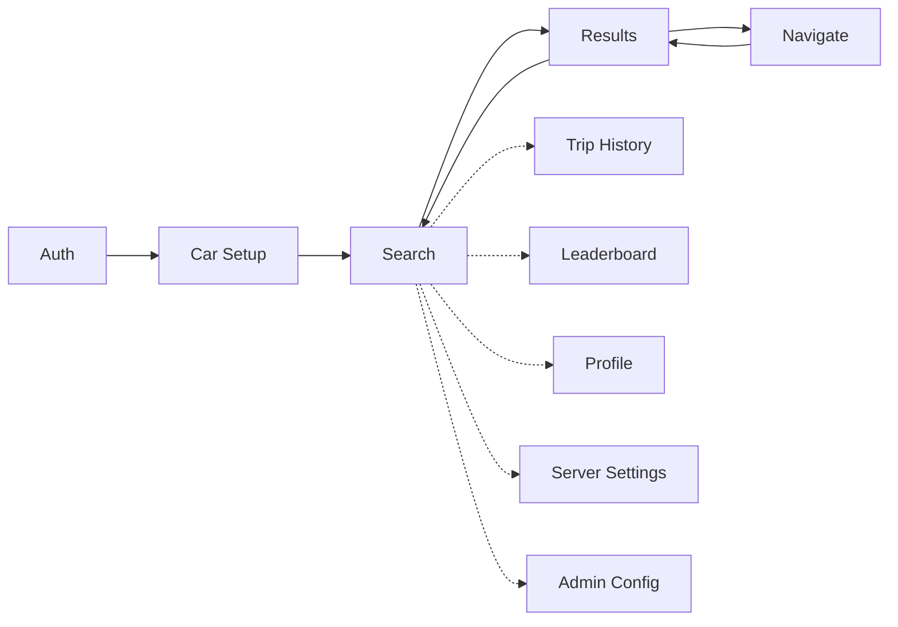

# CHAPTER 4: SYSTEM DESIGN

## 4.1 Overview

This chapter describes the **design** of Intelligent Route Cost & Efficiency. It explains how the system is structured, how users interact with it, and how data flows between the client, server, database, and external services.

The design is based on the requirements in Chapter 3. The system uses a **three-tier architecture**:

1. **Presentation tier** — React web app and Capacitor Android client;
2. **Application tier** — Node.js and Express REST API;
3. **Data tier** — SQLite database plus external OSRM and Nominatim services.

The chapter includes context, use case, activity, class, and sequence diagrams, followed by interface design for the main screens.

---

## 4.2 Context Diagram

The **context diagram** shows the system as one process and its connections to external actors and services.

**Figure 4.1** Context diagram of Intelligent Route Cost & Efficiency

**Table 4.1** External entities and interactions

| Entity | Type | Interaction |
|--------|------|-------------|
| Guest user | Actor | Plans routes and navigates without saving history |
| Registered user | Actor | Plans, navigates, saves trips, uses leaderboard |
| Administrator | Actor | Edits fuel/emission config and user roles |
| SQLite database | Data store | Stores users, trips, leaderboard entries |
| OSRM | External service | Returns driving routes, polylines, turn steps |
| Nominatim | External service | Forward/reverse geocoding for places |
| Device GPS | Hardware | Provides live position during navigation |

The client talks to the backend on port **4000** (default). On mobile, the user may set the PC’s LAN address in **Server Settings** before using the app.

---

## 4.3 Use Case Diagram

**Figure 4.2** Use case diagram

**Table 4.2** Use case summary

| ID | Use case | Primary actor |
|----|----------|---------------|
| UC-01 | Register / Login | Guest, User, Admin |
| UC-02 | Configure Vehicle | Guest, User |
| UC-03 | Plan Route | Guest, User, Admin |
| UC-04 | View Results | Guest, User |
| UC-05 | Start Navigation | Guest, User |
| UC-06 | Complete Trip | Registered User |
| UC-07 | View Trip History | Registered User |
| UC-08 | View Leaderboard | Guest, User |
| UC-09 | Change Password | Registered User |
| UC-10 | Configure Server URL | All users |
| UC-11 | Manage Calculation Config | Administrator |
| UC-12 | Manage User Roles | Administrator |

---

### Use Case Description

#### UC-03: Plan Route

| Item | Description |
|------|-------------|
| **Use case ID** | UC-03 |
| **Name** | Plan Route |
| **Actors** | Guest, Registered User, Administrator |
| **Description** | The user enters an origin and destination. The system geocodes both points, fetches route alternatives, calculates fuel cost and CO₂, and returns results. |

**Preconditions**

- The user has passed the authentication or guest step and completed (or skipped) vehicle setup.
- The client can reach the backend API (health check succeeds).
- Network access to OSRM and Nominatim is available.

**Normal flow**

| Step | Actor / system | Description |
|------|----------------|-------------|
| 1 | User | Enters origin and destination (or selects from autocomplete / GPS origin). |
| 2 | User | Clicks **Calculate**. |
| 3 | System | Sends `POST /api/route` with place names, coordinates, and vehicle efficiency. |
| 4 | System | Backend geocodes locations via Nominatim if needed. |
| 5 | System | Backend requests up to three routes from OSRM. |
| 6 | System | Backend calculates fuel (L), cost (RM), and CO₂ (kg) per route; selects lowest-cost route as recommended. |
| 7 | System | Returns routes, comparison stats, and map polylines to the client. |
| 8 | System | Displays results dashboard and planning map. |

**Postconditions**

- Route result is stored in client state (`result`).
- Application phase changes to **results**.
- User can view comparison or start navigation.

**Alternative flows and exceptions**

| Condition | Handling |
|-----------|----------|
| A1: User uses **Current location** as origin | GPS coordinates sent; reverse geocode applied for display. |
| A2: User skipped vehicle setup | Default **14 km/L** sent as `efficiencyOverride`. |
| E1: Location not found | API returns 400; error message shown on form. |
| E2: OSRM failure | API returns 502/500; user asked to retry. |
| E3: Backend unreachable | Network error; user prompted to check Server URL (mobile). |

**Related non-functional requirements**

- NFR-07: API input validated with Zod.
- NFR-08: Map modules loaded lazily after results.
- NFR-11: CORS allows web and Capacitor clients.

---

#### UC-05: Start Navigation

| Item | Description |
|------|-------------|
| **Use case ID** | UC-05 |
| **Name** | Start Navigation |
| **Actors** | Guest, Registered User |
| **Description** | The user starts GPS turn-by-turn navigation on the recommended route. |

**Preconditions**

- Route results are available (UC-03 completed).
- Device location permission can be granted.

**Normal flow**

| Step | Actor / system | Description |
|------|----------------|-------------|
| 1 | User | Clicks **Start navigation** on results screen. |
| 2 | System | Sets phase to **navigate**; loads MapLibre navigation map. |
| 3 | System | Requests GPS permission; starts position watch. |
| 4 | System | Snaps position to route polyline; shows turn instruction and remaining distance. |
| 5 | System | Updates map puck and camera bearing as user moves. |
| 6 | User | Follows guidance until arrival or taps **End navigation**. |

**Postconditions**

- Navigation state cleared when user ends trip.
- If user completes trip (UC-06), savings may be saved (registered user only).

**Alternative flows and exceptions**

| Condition | Handling |
|-----------|----------|
| A1: User goes **off route** (>80 m) | Warning shown on navigation overlay. |
| A2: User taps **Recenter** | Map camera follows GPS again. |
| A3: User arrives (<80 m from destination) | Arrival state shown; user may complete trip. |
| E1: Location permission denied | Error message; navigation cannot start. |

**Related non-functional requirements**

- NFR-04: Navigation UI optimised for mobile (overlay on full-screen map).
- NFR-09: GPS updates throttled to reduce UI lag.

---

#### UC-06: Complete Trip (summary)

| Item | Description |
|------|-------------|
| **Actors** | Registered User |
| **Preconditions** | User logged in; navigation active or just finished. |
| **Normal flow** | User taps **Complete trip** → system computes savings vs alternative route → updates leaderboard → saves trip to SQLite → shows confirmation. |
| **Exceptions** | Guest user sees message to log in; save skipped. |

*Other use cases (UC-01, UC-07–UC-12) follow the same structure and are mapped to components in Section 4.7.*

---

## 4.4 Activity Diagram

**Figure 4.3** Activity diagram — main user journey (plan route to complete trip)

**Figure 4.4** Activity diagram — backend route calculation

---

## 4.5 Class Diagram

The system is implemented in JavaScript (not classical OOP). **Figure 4.5** shows a **logical class diagram** of main entities, client modules, and server services and their relationships.

**Figure 4.5** Logical class / component diagram

**Figure 4.6** Entity-relationship diagram (database)

---

## 4.6 Sequence Diagram

**Figure 4.7** Sequence diagram — plan route (`POST /api/route`)

**Figure 4.8** Sequence diagram — complete trip (registered user)

---

## 4.7 Interface Design

The user interface is a **single-page application** controlled by a `phase` state: `auth` → `car` → `search` → `results` → `navigate`. On screens **≥768 px** wide, the form appears in a **left sidebar**; on mobile and Android, it uses a **bottom sheet** over a full-screen map.

**Table 4.3** Application phases and main components

| Phase | Purpose | Main component |
|-------|---------|----------------|
| auth | Login, register, or guest | `AuthModal.jsx` |
| car | Select vehicle or skip (14 km/L) | `CarSetupPanel.jsx` / `CarSetupModal.jsx` |
| search | Enter origin and destination | `RouteForm.jsx` |
| results | Compare routes, start navigation | `ResultsDashboard.jsx` |
| navigate | GPS guidance | `NavigationOverlay.jsx` + `NavigationMapView.jsx` |

Modals (lazy-loaded): `Leaderboard.jsx`, `TripHistoryDashboard.jsx`, `ProfileSettings.jsx`, `ServerSettings.jsx`, `AdminConfigModal.jsx`. Admin full page: `/admin` → `AdminPage.jsx`.

---

### 4.7.1 Authentication Screen

- **Layout:** Centred modal on dimmed background; mobile uses rounded bottom sheet style.
- **Elements:** Username, password, optional email (register), toggle Login/Register, **Continue as guest**.
- **Flow:** Success → vehicle setup phase; guest → vehicle setup without `userId`.

*Screenshot placeholder: Figure 4.9 — Authentication screen*

---

### 4.7.2 Vehicle Setup Screen

- **Layout:** Bottom sheet (mobile) or modal (desktop sidebar flow).
- **Elements:** Brand carousel (Toyota, Honda, Proton, Perodua), model carousel, **Continue**, **Skip/Close** (uses default 14 km/L).
- **Feedback:** Selected brand/model shown in top bar during later phases.

*Screenshot placeholder: Figure 4.10 — Vehicle setup screen*

---

### 4.7.3 Route Search and Results

**Route search (`RouteForm.jsx`)**

- Origin field with autocomplete (Nominatim, Malaysia-biased).
- **Current location** button for GPS origin.
- Destination field with autocomplete.
- **Calculate** and **Clear** buttons.

**Results (`ResultsDashboard.jsx`)**

- Recommended route card (green) with distance, duration, RM cost, CO₂, fuel (L).
- Alternative route card (amber) when two distinct paths exist.
- Combined savings card (money, fuel, CO₂ vs alternative).
- **Start navigation** button.
- Planning map (`PlanningMapView.jsx`) shows polylines behind the sheet.

*Screenshot placeholder: Figure 4.11 — Route search screen*  
*Screenshot placeholder: Figure 4.12 — Results and comparison screen*

---

### 4.7.4 Navigation Screen

- **Layout:** Full-screen MapLibre map; navigation overlay at top and bottom.
- **Elements:** Turn instruction banner, distance to turn, ETA, off-route warning, **Recenter**, **End navigation**, **Complete trip**.
- **Map:** Green remaining route, grey travelled segment, user puck with bearing.
- **Thresholds:** Off-route and arrival at **80 m**.

*Screenshot placeholder: Figure 4.13 — GPS navigation screen*

---

### 4.7.5 Trip History and Leaderboard

**Trip History (`TripHistoryDashboard.jsx`)**

- Hero cards: total money saved, fuel saved, CO₂ saved.
- Stat grid: trip count, distance, average emissions.
- Scrollable trip list with resolved place names.

**Leaderboard (`Leaderboard.jsx`)**

- Ranked list with tier badge (Bronze–Legend).
- Personal stats for logged-in user.

*Screenshot placeholder: Figure 4.14 — Trip history dashboard*  
*Screenshot placeholder: Figure 4.15 — Leaderboard screen*

---

### 4.7.6 Profile, Server Settings, and Admin

| Screen | Access | Main actions |
|--------|--------|--------------|
| **Profile** | Logged-in user (burger menu) | Change password |
| **Server Settings** | All users (admin menu link) | Set API URL, test connection |
| **Admin config** | Admin only | Edit fuel price, CO₂ factor, feature flags |
| **Admin users** | Admin only | Promote/demote user roles |
| **Admin page** | `/admin` route | Full-page config and user tabs |

*Screenshot placeholder: Figure 4.16 — Server settings*  
*Screenshot placeholder: Figure 4.17 — Admin configuration*

---

### 4.7.7 Navigation Flow Summary

**Figure 4.18** UI navigation flow

Solid arrows: main phase flow. Dashed arrows: modal overlays from top menu.

---

## 4.8 Summary

This chapter presented the system design of Intelligent Route Cost & Efficiency. The **context diagram** showed the client, API, SQLite database, and external OSRM/Nominatim services. The **use case diagram** defined twelve main functions for guest, registered, and admin users, with detailed descriptions for **Plan Route** and **Start Navigation**.

**Activity diagrams** described the user journey from login to trip completion and the backend route-calculation process. The **class diagram** and **ERD** modelled users, trips, leaderboard data, and major software modules. **Sequence diagrams** illustrated route planning and trip saving.

**Interface design** followed a phase-based flow with responsive layout (sidebar vs bottom sheet). Main screens cover authentication, vehicle setup, search, results, navigation, history, leaderboard, and admin tools.

Chapter 5 explains how these designs were **implemented** in code. Chapter 6 describes **testing** of the designed features.

---

*Author reminder: Export mermaid diagrams as PNG/SVG for the report (Figure 4.1–4.18). Insert actual screenshots in Section 4.7.*
